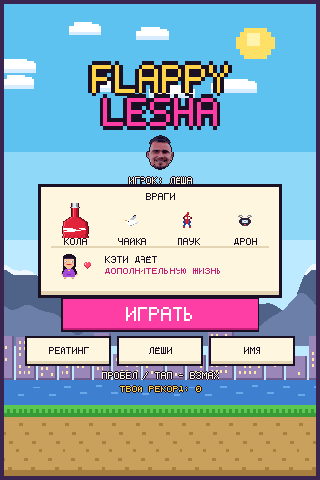
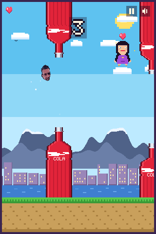
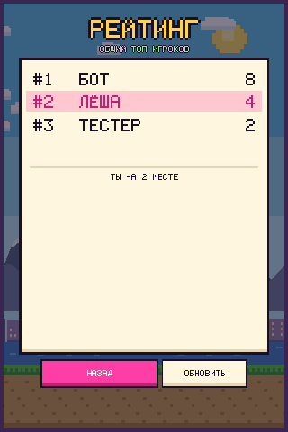
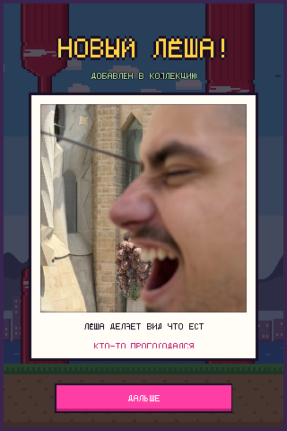
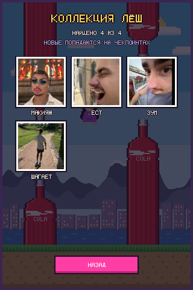

# Flappy Lesha 🎮

8-битный клон Flappy Bird на чистом JavaScript. Вместо птички — пиксельное лицо
с фотографии, враги — бутылки колы, чайки, взболтанные банки и дрон папарацци,
а Кэти Перри пролетает мимо и раздаёт лишние жизни.
Игра спрашивает имя игрока и ведёт общий рейтинг: результаты всех игроков
попадают в одну таблицу, видимую всем.







## Как запустить

Сборка не нужна — это статическая страница.

```bash
# локально
python3 -m http.server 8000     # затем http://localhost:8000

# или просто открыть index.html в браузере
```

Игра — статика без сборки, поэтому на GitHub Pages она раздаётся прямо из
ветки: **Settings → Pages → Source: Deploy from a branch → `main` / `/ (root)`**.
После этого она открывается по адресу вида
`https://aleksandrberlin.github.io/lesha-flappybird/` — и с компьютера, и с
телефона. Файл `.nojekyll` отключает лишнюю обработку Jekyll.

Отдельный workflow для деплоя не нужен: собирать нечего. Он понадобился бы,
только если появится шаг сборки или захочется публиковать не весь репозиторий.

## Управление

| Действие | Компьютер | Телефон |
| --- | --- | --- |
| Взмах | `Space`, `↑`, `W`, `Enter`, клик | тап по экрану |
| Пауза | `P` | иконка паузы в углу |
| Звук | `M` | иконка динамика в углу |
| Рейтинг | `L` | кнопка «Рейтинг» |
| Коллекция Лёш | `C` | кнопка «Лёши» |
| Сменить имя | `N` | кнопка «Имя» |
| Заново | `R` | кнопка «Ещё раз» |

На телефоне канвас растягивается на весь экран, страница не скроллится и не
зумится, кнопки сделаны крупными под палец.

## Геймплей

Пролетай в зазор между бутылками колы — каждая пройденная пара даёт очко,
облёт любого летающего врага тоже даёт очко.

**Враги** открываются по мере роста счёта:

| Враг | С какого счёта | Поведение |
| --- | --- | --- |
| Бутылки колы | сразу | «трубы» с зазором, стоят и лежат навстречу |
| Чайка | 2 | летит навстречу по синусоиде, машет крыльями |
| Банка колы | 7 | взболтанная банка: влетает медленно и разгоняется как ракета, оставляя шипучий след |
| Дрон папарацци | 12 | подлетает и медленно подстраивается под твою высоту — от него не улететь по прямой |

**Кэти Перри — не враг, а бонус.** Она проплывает через экран с сердечком над
головой; поймаешь — получишь лишнюю жизнь (максимум 3). Если жизни уже полные,
вместо жизни дают +3 очка.

**Жизни.** Старт — одна жизнь, сердечки видны слева сверху. Если жизней больше
одной, столкновение не убивает: теряется сердечко, препятствие разлетается
вдребезги, и на полторы секунды включается неуязвимость (герой мигает).
Падение на землю фатально всегда.

Скорость подлёта летающих врагов и Кэти подбирается так, чтобы встреча
пришлась на свободный коридор между бутылками — их всегда можно облететь.

**Сложность.** Каждые 8 очков — новый уровень с надписью «скорость +»:

| Счёт | Скорость | Зазор | Пауза между парами |
| --- | --- | --- | --- |
| 0 | 1.75 | 150 px | 1.8 с |
| 10 | 2.14 | 138 px | 1.4 с |
| 20 | 2.53 | 125 px | 1.1 с |
| 30 | 2.92 | 113 px | 0.9 с |
| 40+ | 3.7 | 100 px | 0.7 с |

Вдобавок расстояние между парами каждый раз слегка гуляет, четверть пар
ставится теснее базового зазора, а чем дальше, тем сильнее зазоры прыгают по
высоте — лететь по одной линии уже не выйдет. Летающих врагов после 25 очков
может быть до четырёх одновременно.

Медали: бронза с 10 очков, серебро с 20, золото с 40.

## Чекпоинты и коллекция Лёш

Каждые 10 очков игра замирает и показывает чекпоинт: счёт, фотографию в
рамке-полароиде и подпись. Лёша на чекпоинте выбирается **случайно** — но с
перевесом в сторону тех, кого игрок ещё не находил, и никогда два раза подряд
один и тот же. Если Лёша новый, вместо «чекпоинта» появляется «НОВЫЙ ЛЁША!»,
играет фанфара и он добавляется в коллекцию.

Фотографии остаются фотографиями, а не пиксель-артом: рамка и текст вокруг
восьмибитные, само фото рисуется со сглаживанием. У Лёши может быть несколько
кадров — тогда они крутятся как анимация (шагающий Лёша собран из пяти кадров,
7 кадров в секунду). Дальше — тап, пробел или кнопка «дальше», после чего
даётся полторы секунды неуязвимости.

**Коллекция** открывается кнопкой «Лёши» с титульного экрана или экрана
проигрыша, а также клавишей `C`. Это сетка находок: собранные показываются
фотографией с именем, ненайденные — как «?». Тап по собранному открывает его
крупно с подписью. Коллекция привязана к имени игрока: она хранится локально и
дублируется в Supabase (таблица `flappy_lesha_finds`), поэтому с тем же именем
находки подтянутся и на другом устройстве.

Сейчас в игре четыре Лёши: в макияже, делает вид что ест, зум и шагает.
Добавить своего:

```bash
# одно фото: слот 5, квадратный кроп вокруг точки (cx, cy) со стороной side
python3 tools/make_checkpoints.py 5 фото.jpg --crop 1000,1150,1500

# анимация: несколько кадров в один слот
python3 tools/make_checkpoints.py 6 кадр1.jpg кадр2.jpg кадр3.jpg
```

Скрипт кладёт кадры в `assets/checkpoints/<слот>/` и пересобирает
`src/checkpoints-data.js`, где они лежат в base64 — поэтому игра работает и с
`file://`. После этого добавьте слот в `order` в
[`src/checkpoints.js`](src/checkpoints.js); там же имя, подпись, частота
чекпоинтов и скорость анимации.

## Рейтинг игроков

При первом запуске игра спрашивает имя (до 12 символов, латиница и кириллица).
Имя хранится в `localStorage`, его можно сменить кнопкой «Имя» или клавишей `N`.

Результаты уходят в Supabase — таблица `flappy_lesha_scores`, SQL лежит в
[`supabase/schema.sql`](supabase/schema.sql). Ключ в `src/config.js` —
publishable (anon), он и предназначен для публичного кода: политики RLS
разрешают только читать таблицу и добавлять свой результат, менять и удалять
чужие записи нельзя. В рейтинге показывается лучший результат каждого игрока
(view `flappy_lesha_leaderboard`).

Если сети нет, игра не ломается: результат сохраняется локально, показывается
локальный топ с пометкой, а неотправленные результаты уходят на сервер при
следующем удачном подключении. Чтобы вообще отключить облако, поставьте в
`src/config.js` режим `"local"`.

## Структура

```
index.html            разметка, диалог имени, порядок подключения скриптов
css/style.css         оформление страницы и диалога, мобильная вёрстка
src/config.js         настройки хранилища рекордов
src/checkpoints.js    список Лёш: имена, подписи, частота чекпоинтов
src/collection.js     коллекция находок игрока (локально + Supabase)
src/assets-data.js    спрайты: лицо в base64, Кэти, бутылка, чайка, дрон, банка, сердце
src/font.js           растровый шрифт 5x7 (латиница, кириллица, цифры)
src/scores.js         рейтинг: Supabase + локальное зеркало и очередь отправки
src/audio.js          чиптюн-звуки на WebAudio
src/overlay.js        диалог «Кто вы?»
src/game.js           игровой цикл, физика, враги, экраны, интерфейс
assets/hero.png       спрайт лица 36x36
assets/checkpoints/   фотографии Лёш, по папке на слот (несколько кадров = анимация)
supabase/schema.sql   таблица рейтинга и политики доступа
tools/make_assets.py  генерация спрайтов из фотографии
tools/make_checkpoints.py  подготовка фото для чекпоинтов
tools/smoke-test.js   headless-проверка игры через Playwright
```

Всё рисуется на `<canvas>` 320x480 с отключённым сглаживанием: на компьютере
масштаб целочисленный, на телефоне канвас подгоняется под экран.

## Спрайт лица

```bash
pip install pillow
python3 tools/make_assets.py путь/к/фото.jpg
```

Лицо вырезается по эллипсу-голове, уменьшается до 36x36, квантуется до 16
цветов, очищается от остатков фона (небо, город за головой, одиночные пиксели
на контуре) и обводится тёмным контуром. Скрипт перезаписывает `assets/hero.png` и
`src/assets-data.js`; исходное фото в репозиторий не попадает. Положение головы
задаётся константами `HEAD`, `HEAD_RX`, `HEAD_RY` в начале скрипта.

## Тесты

```bash
npm i playwright
python3 -m http.server 8777 &
node tools/smoke-test.js
```

Автопилот играет ~45 секунд и проверяет, что нет ошибок в консоли, имя
сохраняется, счёт растёт, появляются летающие враги, Кэти выходит и её бонус
на жизнь подбирается, рейтинг загружается, а экран проигрыша работает.
